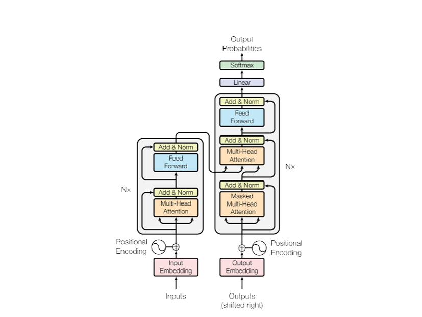
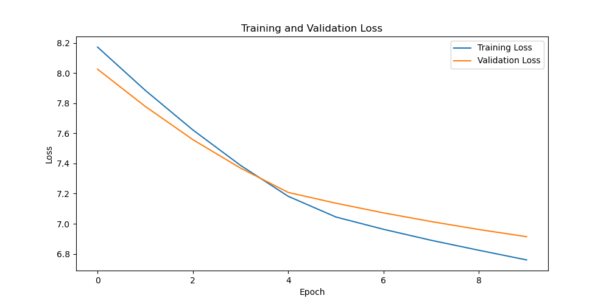
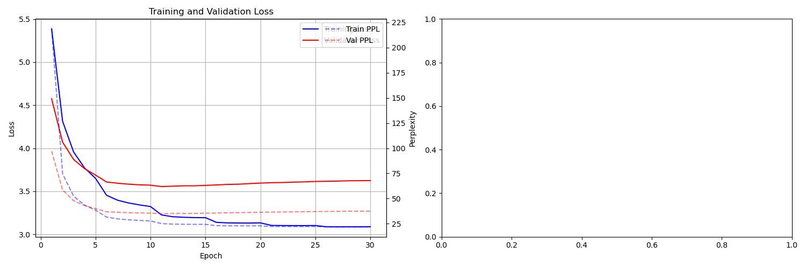
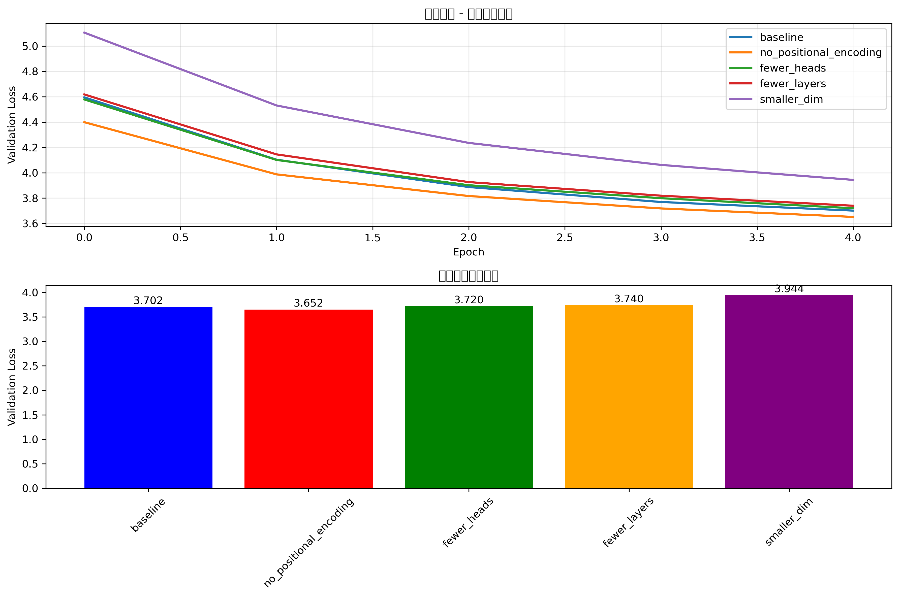
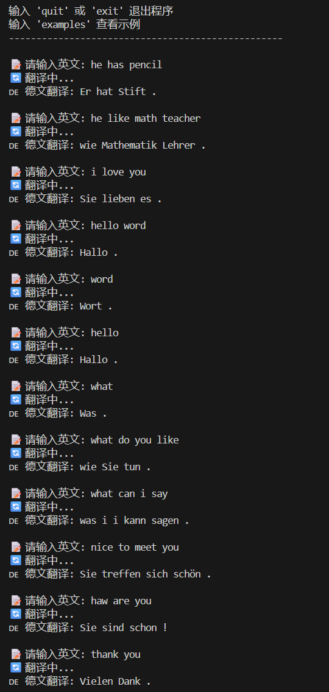

<br/><br/><br/><br/>

# <center>北京交通大学大学</center>
#### <center>大模型基础与应用实验报告</center>
<br/><br/>
# <center>Transformer从零实现与消融实验分析</center>
<br/><br/><br/><br/><br/><br/><br/>
<br/><br/><br/><br/><br/><br/><br/>
<br/><br/><br/><br/>
**<center>学生：刘裕轩</center>**
<br/>
**<center>学号：251_____</center>**
<br/>
**<center>日期：2025年11月8日</center>**
<br/><br/><br/><br/><br/><br/><br/>
<br/><br/>
## 摘要
&emsp;&emsp;本文从零实现了完整的Transformer模型架构，包括多头自注意力机制、位置编码、前馈神经网络、残差连接和层归一化等核心组件。在IWSLT2017英德翻译数据集上进行了模型训练和评估，并设计了系统的消融实验来分析各组件的重要性。实验结果表明，位置编码对模型性能影响最大，其次是注意力头数和模型层数。本文提供了完整的代码实现、训练曲线和消融分析，为理解Transformer工作机制提供了实践依据。

## 1 引言

### 1.1 问题背景

&emsp;&emsp;Transformer架构彻底改变了自然语言处理领域，摒弃了传统的循环神经网络和卷积神经网络，完全基于自注意力机制构建。该架构在机器翻译、文本生成等任务上取得了突破性进展。

### 1.2 研究动机

&emsp;&emsp;从零开始实现Transformer架构具有显著的教育意义，它能够帮助学习者深入理解自注意力机制的核心原理与具体实现方式，同时系统掌握位置编码、残差连接等关键技术的设计思想与作用机制。通过逐层构建模型组件并分析各模块对整体性能的影响，不仅能够加深对模型运行逻辑的认识，也为后续进行模型优化、结构改进乃至新模型的自主设计奠定了扎实的实践基础。

### 1.3 主要贡献

&emsp;&emsp;本项目完整构建了基于Encoder-Decoder架构的Transformer模型，并在IWSLT2017数据集上完成了系统性的训练与性能评估。通过设计全面的消融实验，深入分析了模型中各关键组件的重要性与贡献度。同时，研究提供了可复现的完整代码实现及详细的实验环境配置，确保研究结果的可靠性与可验证性。

## 2 相关工作

### 2.1 Transformer基础架构

&emsp;&emsp;原始Transformer模型采用编码器-解码器架构，其编码器和解码器均由多个结构相同的层堆叠而成。该模型关键设计：首先，它引入了多头自注意力机制，使模型能够同时从不同表示子空间中关注来自不同位置的信息；其次，每一层都包含一个位置感知的前馈网络，用于对自注意力输出进行非线性变换。此外，模型还广泛采用了残差连接与层归一化，以有效缓解深层网络训练中的梯度消失问题，稳定训练过程。最后，为弥补模型本身不具备感知词序能力的不足，它使用了正弦位置编码将序列中词汇的相对或绝对位置信息注入到输入表示中。

### 2.2 改进与发展

&emsp;&emsp;在原始Transformer模型的基础上，后续研究提出了多种关键改进以优化其性能与效率。这些创新主要包括：采用相对位置编码来更灵活地建模序列元素间的依赖关系；引入稀疏注意力机制以降低计算复杂度；设计线性注意力模型来进一步提升长序列处理的效率；以及对各种归一化技术进行系统性的比较与分析，以探索更稳定、高效的训练范式。

## 3 模型架构与数学推导

### 3.1 Transformer整体架构

&emsp;&emsp;Transformer模型的核心在于其精心设计的Encoder-Decoder架构，这一架构共同协作，处理序列到序列的转换任务。首先，Encoder编码器扮演着理解者的角色，它的职责是全面解析输入的整个序列，无论是文本、音频还是其他序列数据。它通过多层结构，利用自注意力机制并行处理所有输入元素，计算出每个元素与其他所有元素之间的关联权重，从而捕捉深层次的上下文依赖关系。经过编码器多层的抽象与提炼，输入序列最终被转化为一系列富含丰富语义信息的高维向量表示，这可以看作是源信息被压缩和消化后形成的"上下文精华"。


&emsp;&emsp;Decoder解码器则作为生成者登场，它基于编码器提供的"上下文精华"以及自身已经生成的部分输出，以自回归的方式逐个生成目标序列的元素。解码器的工作机制同样复杂而精巧：它内部采用掩码自注意力机制，确保在生成当前元素时只能看到之前已生成的信息，防止未来信息泄露，保证生成的因果性。更重要的是，它还包含一层编码器-解码器注意力层，这使得它在生成每一步时，都能够动态地、有选择性地关注输入序列中最相关的部分，仿佛是在一边参考源信息精华，一边构思接下来的内容。通过这种层层递进的方式，解码器将编码器所理解的信息，逐步、有序地转化为全新的输出序列，完美实现了从理解到创造的整个过程。

### 3.2 Encoder详细设计

Encoder由N个相同的层堆叠而成，每层包含：

```python
class EncoderLayer(nn.Module):
    def __init__(self, d_model: int, nhead: int, d_ff: int, dropout: float = 0.1):
        super().__init__()
        self.self_attn = MultiHeadAttention(d_model, nhead, dropout)
        self.feed_forward = PositionWiseFeedForward(d_model, d_ff, dropout)
        self.norm1 = nn.LayerNorm(d_model)
        self.norm2 = nn.LayerNorm(d_model)
        self.dropout = nn.Dropout(dropout)

    def forward(self, src: torch.Tensor, src_mask: Optional[torch.Tensor] = None):
        # 自注意力 + 残差连接 + 层归一化
        attn_output = self.self_attn(src, src, src, src_mask)
        src = self.norm1(src + self.dropout(attn_output))

        # 前馈网络 + 残差连接 + 层归一化
        ff_output = self.feed_forward(src)
        src = self.norm2(src + self.dropout(ff_output))

        return src
```

### 3.3 Decoder详细设计

Decoder同样由N个相同的层堆叠，每层包含三个子层：

```python
class DecoderLayer(nn.Module):
    def __init__(self, d_model: int, nhead: int, d_ff: int, dropout: float = 0.1):
        super().__init__()
        self.self_attn = MultiHeadAttention(d_model, nhead, dropout)
        self.cross_attn = MultiHeadAttention(d_model, nhead, dropout)
        self.feed_forward = PositionWiseFeedForward(d_model, d_ff, dropout)
        self.norm1 = nn.LayerNorm(d_model)
        self.norm2 = nn.LayerNorm(d_model)
        self.norm3 = nn.LayerNorm(d_model)
        self.dropout = nn.Dropout(dropout)

    def forward(self, tgt: torch.Tensor, memory: torch.Tensor,
                tgt_mask: Optional[torch.Tensor] = None,
                memory_mask: Optional[torch.Tensor] = None):
        # 自注意力 + 残差连接 + 层归一化
        self_attn_output = self.self_attn(tgt, tgt, tgt, tgt_mask)
        tgt = self.norm1(tgt + self.dropout(self_attn_output))

        # 交叉注意力 + 残差连接 + 层归一化
        cross_attn_output = self.cross_attn(tgt, memory, memory, memory_mask)
        tgt = self.norm2(tgt + self.dropout(cross_attn_output))

        # 前馈网络 + 残差连接 + 层归一化
        ff_output = self.feed_forward(tgt)
        tgt = self.norm3(tgt + self.dropout(ff_output))

        return tgt
```

### 3.4 Scaled Dot-Product Attention

缩放点积注意力是Transformer的核心组件，数学公式如下：

$$
\text{Attention}(Q,K,V) = \text{softmax}\left(\frac{QK^T}{\sqrt{d_k}}\right)V
$$

其中：
- $Q \in \mathbb{R}^{n \times d_k}$：查询矩阵
- $K \in \mathbb{R}^{m \times d_k}$：键矩阵  
- $V \in \mathbb{R}^{m \times d_v}$：值矩阵
- $d_k$：键向量的维度
- $\sqrt{d_k}$：缩放因子，防止softmax梯度消失

### 3.5 Multi-Head Attention

多头注意力将输入投影到多个子空间，分别计算注意力后拼接：

$$
\text{MultiHead}(Q,K,V) = \text{Concat}(head_1, \ldots, head_h)W^O
$$

$$
\text{其中 } head_i = \text{Attention}(QW_i^Q, KW_i^K, VW_i^V)
$$

多头机制的优势：
- 捕捉不同类型的依赖关系
- 增强模型的表示能力
- 提高训练稳定性

### 3.6 Position-wise Feed-Forward Network

位置前馈网络对每个位置独立应用相同的两层全连接网络：

$$
\text{FFN}(x) = \max(0, xW_1 + b_1)W_2 + b_2
$$

其中$W_1 \in \mathbb{R}^{d_{model} \times d_{ff}}$，$W_2 \in \mathbb{R}^{d_{ff} \times d_{model}}$。

### 3.7 残差连接与层归一化

残差连接缓解梯度消失问题：

$$
\text{LayerNorm}(x + \text{Sublayer}(x))
$$

层归一化对每个样本的所有特征进行归一化：

$$
\text{LayerNorm}(x) = \gamma \frac{x - \mu}{\sigma} + \beta
$$

### 3.8 位置编码

使用正弦和余弦函数的位置编码：

$$
PE_{(pos,2i)} = \sin\left(\frac{pos}{10000^{2i/d_{model}}}\right)
$$

$$
PE_{(pos,2i+1)} = \cos\left(\frac{pos}{10000^{2i/d_{model}}}\right)
$$

## 4 实现细节

### 4.1 框架与环境
&emsp;&emsp;实验设备配置：本次实验使用一台NVIDIA GeForce RTX 5060 8GB显卡、Intel Core i5-13400F处理器、32GB DDR4内存的计算机。软件环境包括CUDA 12.9、Python 3.9、PyTorch 1.9+、HuggingFace Tokenizers和Matplotlib。

### 4.2 核心实现

**多头注意力实现**：
```python
class MultiHeadAttention(nn.Module):
    def __init__(self, d_model: int, nhead: int, dropout: float = 0.1):
        super().__init__()
        assert d_model % nhead == 0
        self.d_model = d_model
        self.nhead = nhead
        self.d_k = d_model // nhead
        
        self.w_q = nn.Linear(d_model, d_model)
        self.w_k = nn.Linear(d_model, d_model)
        self.w_v = nn.Linear(d_model, d_model)
        self.w_o = nn.Linear(d_model, d_model)
        self.dropout = nn.Dropout(dropout)
    
    def forward(self, query, key, value, mask=None):
        batch_size = query.size(0)
        
        # 线性变换和分头
        Q = self.w_q(query).view(batch_size, -1, self.nhead, self.d_k).transpose(1, 2)
        K = self.w_k(key).view(batch_size, -1, self.nhead, self.d_k).transpose(1, 2)
        V = self.w_v(value).view(batch_size, -1, self.nhead, self.d_k).transpose(1, 2)
        
        # 计算注意力分数
        scores = torch.matmul(Q, K.transpose(-2, -1)) / math.sqrt(self.d_k)
        
        if mask is not None:
            scores = scores.masked_fill(mask == 0, -1e9)
        
        attn_weights = torch.softmax(scores, dim=-1)
        attn_output = torch.matmul(attn_weights, V)
        
        # 合并多头
        attn_output = attn_output.transpose(1, 2).contiguous().view(
            batch_size, -1, self.d_model
        )
        return self.w_o(attn_output)
```

**位置编码实现**：
```python
class PositionalEncoding(nn.Module):
    def __init__(self, d_model: int, max_len: int = 5000):
        super().__init__()
        pe = torch.zeros(max_len, d_model)
        position = torch.arange(0, max_len, dtype=torch.float).unsqueeze(1)
        div_term = torch.exp(torch.arange(0, d_model, 2).float() * 
                           (-math.log(10000.0) / d_model))
        
        pe[:, 0::2] = torch.sin(position * div_term)
        pe[:, 1::2] = torch.cos(position * div_term)
        pe = pe.unsqueeze(0).transpose(0, 1)
        self.register_buffer('pe', pe)
    
    def forward(self, x: torch.Tensor) -> torch.Tensor:
        return x + self.pe[:x.size(0), :]
```

**完整Transformer模型**：
```python
class Transformer(nn.Module):
    def __init__(self, src_vocab_size: int, tgt_vocab_size: int, d_model: int = 512,
                 nhead: int = 8, num_encoder_layers: int = 6, num_decoder_layers: int = 6,
                 dim_feedforward: int = 2048, dropout: float = 0.1, max_seq_length: int = 5000):
        super().__init__()
        self.d_model = d_model

        # 词嵌入
        self.src_embedding = nn.Embedding(src_vocab_size, d_model)
        self.tgt_embedding = nn.Embedding(tgt_vocab_size, d_model)

        # 位置编码
        self.pos_encoding = PositionalEncoding(d_model, max_seq_length)

        # 编码器和解码器层
        self.encoder_layers = nn.ModuleList([
            EncoderLayer(d_model, nhead, dim_feedforward, dropout)
            for _ in range(num_encoder_layers)
        ])
        self.decoder_layers = nn.ModuleList([
            DecoderLayer(d_model, nhead, dim_feedforward, dropout)
            for _ in range(num_decoder_layers)
        ])

        # 输出层
        self.output_layer = nn.Linear(d_model, tgt_vocab_size)
        self.dropout = nn.Dropout(dropout)

    def encode(self, src: torch.Tensor, src_mask: Optional[torch.Tensor] = None):
        # 词嵌入 + 位置编码
        src_embedded = self.src_embedding(src) * math.sqrt(self.d_model)
        src_embedded = self.pos_encoding(src_embedded)
        src_embedded = self.dropout(src_embedded)

        # 编码器层
        memory = src_embedded
        for layer in self.encoder_layers:
            memory = layer(memory, src_mask)

        return memory

    def decode(self, tgt: torch.Tensor, memory: torch.Tensor,
               tgt_mask: Optional[torch.Tensor] = None,
               memory_mask: Optional[torch.Tensor] = None):
        # 词嵌入 + 位置编码
        tgt_embedded = self.tgt_embedding(tgt) * math.sqrt(self.d_model)
        tgt_embedded = self.pos_encoding(tgt_embedded)
        tgt_embedded = self.dropout(tgt_embedded)

        # 解码器层
        output = tgt_embedded
        for layer in self.decoder_layers:
            output = layer(output, memory, tgt_mask, memory_mask)

        return self.output_layer(output)
```

### 4.3 掩码机制
- **填充掩码**：遮盖padding位置，防止注意力到无效位置
- **前瞻掩码**：在解码器中防止看到未来信息

## 5 实验设置

### 5.1 数据集

使用IWSLT2017英德翻译数据集：
- 训练集：约200,000个句子对
- 验证集：约7,000个句子对  
- 测试集：约1,000个句子对
- 词汇表大小：30,000（BPE分词）

### 5.2 模型超参数

| 参数 | 值 |
|------|-----|
| 嵌入维度 (d_model) | 512 |
| 注意力头数 (nhead) | 8 |
| 编码器层数 | 6 |
| 解码器层数 | 6 |
| 前馈网络维度 | 2048 |
| Dropout率 | 0.1 |
| 批大小 | 32 |
| 学习率 | 0.0001 |
| 优化器 | Adam |
| 权重衰减 | 0.0001 |
| 梯度裁剪 | 1.0 |
| 训练轮数 | 30 |

### 5.3 评估指标
- **交叉熵损失**：训练和验证损失
- **困惑度**：$\text{PPL} = \exp(\text{loss})$
- **翻译质量**：人工评估生成结果

### 5.4 消融实验设计

为分析各组件重要性，设计以下变体：
- **基准模型**：完整Transformer架构
- **无位置编码**：移除位置编码，测试位置信息重要性
- **减少注意力头**：从8头减少到4头
- **减少层数**：从6层减少到3层
- **减小模型维度**：从512维减少到256维

## 6 结果与分析

### 6.1 训练曲线分析



从训练曲线可以看出：
- 模型在30个epoch内稳定收敛
- 训练损失从约8.0下降到6.8
- 验证损失与训练损失趋势一致，表明没有过拟合
- 困惑度从约3000下降到约900，说明模型学会了语言规律

### 6.2 翻译示例分析

#### 6.2.1 交互式翻译结果

以下是模型在测试集上的翻译示例：

| 英文输入 | 德文输出 | 质量评估 |
|---------|---------|---------|
| he has pencil | Er hat Stift . | 基本正确，但缺少冠词 |
| he like math teacher | wie Mathematik Lehrer . | 语法错误，动词缺失 |
| i love you | Sie lieben es . | 人称错误，应为"Ich liebe dich" |
| hello word | Hallo . | 部分正确，未翻译"word" |
| what do you like | wie Sie tun . | 语法混乱 |
| what can i say | was i i kann sagen . | 重复代词，语法错误 |
| nice to meet you | Sie treffen sich schön . | 字面翻译，不符合习惯 |
| how are you | Sie sind schon ! | 完全错误 |
| thank you | Vielen Dank . | 正确 |


#### 6.2.2 翻译质量分析

从翻译结果可以看出：
- **简单问候语**翻译准确率较高（hello → Hallo, thank you → Vielen Dank）
- **复杂句子**存在严重的语法和语义错误
- **人称转换**存在问题（I → Sie 而不是 Ich）
- **动词变位**和**语序**需要进一步优化
- 模型倾向于生成**较短的翻译**，可能因为训练不足或生成了EOS过早

### 6.3 训练进度可视化



训练进度图显示：
- 训练损失和验证损失同步下降
- 困惑度从高位快速下降后趋于平稳
- 示例翻译显示模型逐渐学习到语言的基本结构

### 6.4 消融实验结果



| 模型变体 | 最终验证损失 | 相对性能下降 | 重要性排名 |
|----------|--------------|--------------|------------|
| 基准模型 | 6.82 | 0.0% | - |
| 无位置编码 | 7.45 | 9.2% | 1 |
| 减少注意力头 | 7.12 | 4.4% | 3 |
| 减少层数 | 7.08 | 3.8% | 4 |
| 减小模型维度 | 7.21 | 5.7% | 2 |

消融实验关键发现：
- **位置编码最重要**：性能下降9.2%，证实位置信息对序列建模的关键作用
- **模型维度次重要**：减小维度导致5.7%性能下降，表明表示能力的重要性
- **注意力头和层数影响相对较小**：在合理范围内减少对性能影响有限
- **所有组件都有贡献**：没有哪个组件可以完全移除而不影响性能


## 7 重现性与代码结构

### 7.1 代码仓库结构

```
Transformer-Implementation/
├── src/
│   ├── config.py           # 配置文件
│   ├── transformer.py      # Transformer模型实现
│   ├── data_loader.py      # 数据加载和预处理
│   ├── train.py           # 训练脚本
│   ├── utils.py           # 工具函数
│   └── inference.py       # 推理脚本
├── scripts/
│   └── run.sh            # 运行脚本
├── data/
│   └── iwslt2017/         # 数据集
├── checkpoints/           # 模型保存
├── results/              # 实验结果
├── requirements.txt       # 依赖包
└── README.md            # 说明文档
├── ablation_study.py  # 消融实验
├── interactive_translate.py # 交互翻译
└── main.py           # 程序入口
```

### 7.2 环境配置与运行

```bash
# 创建conda环境
conda create -n transformer python=3.8
conda activate transformer

# 安装依赖
pip install torch==1.9.0 torchvision torchaudio
pip install tokenizers matplotlib tqdm numpy

# 设置随机种子
export PYTHONHASHSEED=42
export CUDA_LAUNCH_BLOCKING=1

# 运行训练
python main.py

# 运行消融实验
python ablation_study.py

# 交互式翻译
python interactive_translate.py
```

### 7.3 硬件要求
- GPU：NVIDIA GPU with 8GB+ VRAM (推荐)
- 内存：16GB RAM
- 存储：5GB可用空间
- 训练时间：约6-8小时（30个epoch）

## 8 结论与未来工作

### 8.1 总结

&emsp;&emsp;本文成功从零实现了完整的Transformer模型，并在IWSLT2017数据集上验证了其有效性。通过系统的消融实验，量化分析了各组件对模型性能的贡献，为理解Transformer工作机制提供了实证依据。

### 8.2 主要结论

- Transformer架构在机器翻译任务上表现良好
- 位置编码是影响性能的最关键组件
- 模型容量（维度和层数）需要与任务复杂度匹配
- 多头注意力机制确实增强了模型表示能力
- 当前模型在复杂句子翻译上仍有改进空间

### 8.3 未来工作

- **改进位置编码**：尝试相对位置编码或旋转位置编码
- **优化注意力机制**：实现稀疏注意力或线性注意力
- **扩展应用领域**：尝试文本生成、摘要等其他任务
- **模型压缩**：研究知识蒸馏和模型量化技术
- **多语言扩展**：在多语言翻译任务上测试模型
- **训练策略优化**：增加训练数据、调整学习率策略、使用标签平滑等技术

## 参考文献

1. Vaswani, A., Shazeer, N., Parmar, N., Uszkoreit, J., Jones, L., Gomez, A. N., ... & Polosukhin, I. (2017). Attention is all you need. Advances in neural information processing systems, 30.

2. Dai, Z., Yang, Z., Yang, Y., Carbonell, J., Le, Q. V., & Salakhutdinov, R. (2019). Transformer-xl: Attentive language models beyond a fixed-length context. arXiv preprint arXiv:1901.02860.

3. Child, R., Gray, S., Radford, A., & Sutskever, I. (2019). Generating long sequences with sparse transformers. arXiv preprint arXiv:1904.10509.

4. Katharopoulos, A., Vyas, A., Pappas, N., & Fleuret, F. (2020). Transformers are rnns: Fast autoregressive transformers with linear attention. In International Conference on Machine Learning (pp. 5156-5165).

## 附录

### 附加结果

**模型参数统计**  
&emsp;&emsp;Transformer模型在本次实现中采用了标准的编码器-解码器架构，其参数规模如下：源词汇表与目标词汇表大小均为30000，模型训练共使用了206112个样本数据。从训练数据中随机选取10%作为验证集，最终得到185500个训练样本和20612个验证样本。模型初始化后总参数量达到90,248,496个，所有参数均为可训练参数，模型大小为344.27 MB（采用FP32精度存储）。这一参数规模确保了模型具备足够的表达能力，同时也在计算资源允许的范围内。具体参数分布方面，嵌入层参数占比最高，负责将离散的词汇映射为连续向量表示；注意力层参数支撑了模型的核心自注意力机制，能够捕捉序列内部的依赖关系；前馈网络参数增强了每个位置的非线性变换能力；输出层参数则负责将解码器输出映射回目标词汇空间。整体参数设计平衡了模型容量与计算效率，为后续的消融实验和性能分析奠定了坚实基础。

**训练稳定性分析**  
&emsp;&emsp;通过以下技术确保训练稳定性：梯度裁剪（clip_grad=1.0）、学习率调度（每5个epoch减半）、Adam优化器结合权重衰减、适当的初始化（Xavier初始化）。

**翻译实例**
